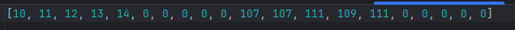

## Разработать ассемблер и интерпретатор для учебной виртуальной машины (УВМ).Система команд УВМ представлена далее. ##
        Для ассемблера необходимо разработать читаемое представление команд
    УВМ. Ассемблер принимает на вход файл с текстом исходной программы, путь к
    которой задается из командной строки. Результатом работы ассемблера является
    бинарный файл в виде последовательности байт, путь к которому задается из
    командной строки. Дополнительный ключ командной строки задает путь к файлулогу, 
    в котором хранятся ассемблированные инструкции в духе списков
    “ключ=значение”, как в приведенных далее тестах.

        Интерпретатор принимает на вход бинарный файл, выполняет команды УВМ
    и сохраняет в файле-результате значения из диапазона памяти УВМ. 
        Диапазон также указывается из командной строки.</h3>

## Формат команд УВМ

### 1. Загрузка константы
- **Формат команды**: 6 байт
- **Операнд**: поле B
- **Результат**: регистр по адресу, заданному полем C
- **Пример команды**: (A=58, B=99, C=20)  
  **Машинный код**: `0xBA, 0x31, 0x00, 0x00, 0x80, 0x02`

### 2. Чтение значения из памяти
- **Формат команды**: 3 байта
- **Операнд**: значение в памяти по адресу, заданному полем C
- **Результат**: регистр по адресу, заданному полем B
- **Пример команды**: (A=3, B=23, C=258)  
  **Машинный код**: `0x83, 0x2B, 0x10`

### 3. Запись значения в память
- **Формат команды**: 4 байта
- **Операнд**: регистр по адресу, заданному полем B
- **Результат**: значение в памяти по адресу, заданному суммой адреса (регистр по адресу поля C) и смещения (поле D)
- **Пример команды**: (A=30, B=5, C=18, D=790)  
  **Машинный код**: `0x9E, 0x22, 0x2D, 0x06`

### 4. Бинарная операция: побитовое "или"
- **Формат команды**: 5 байт
- **Первый операнд**: регистр по адресу, заданному полем D
- **Второй операнд**: значение в памяти по адресу, заданному регистром по адресу поля B
- **Результат**: значение в памяти по адресу, заданному суммой адреса (регистр по адресу поля E) и смещения (поле C)
- **Пример команды**: (A=124, B=1, C=56, D=25, E=27)  
  **Машинный код**: `0xFC, 0x80, 0x03, 0xC8, 0x1B`

## Установка и запуск

1. **Компиляция программы** (Ассемблер):
   ```bash
   python assembler.py <путь_к_исходному_файлу> <путь_к_бинарному_файлу> <путь_к_файлу_логу>
   ```
    Для запуска программы ассемблера используйте:
    ```bash
    python assembler.py program.asm program.bin log.json   
    ```
2. **Выполнение программы** (Интерпретатор):
    ```bash
    python interpreter.py <путь_к_бинарному_файлу> <путь_к_файлу_результатов> <диапазон_памяти>  
    ```
   Для запуска программы интерпретатора используйте:
    ```bash
   python interpreter.py program.bin result.json 0,256 
    ```
## Формат выходных файлов  
- **Файл-лог**: JSON-файл, содержащий ассемблированные инструкции в формате ключ=значение.
- **Файл-результат:**: JSON-файл с результатами выполнения команд в заданном диапазоне памяти.

## Тестирование
Выполнить поэлементно операцию побитовое "или" над двумя векторами длины 5. Результат записать во второй вектор

Для запуска программы ассемблера используйте:
   ```bash
    python assembler.py test.asm program.bin log.json   
   ```
Для запуска программы интерпретатора используйте:
   ```bash
    python interpreter.py program.bin result_test.json 0,100  
   ```
**Входные данные**: два вектора со значениями [10, 11, 12, 13, 14] и [105, 106, 107, 108, 109]

**Ожидаемые данные**: поэлементная операция побитовое "или" над двумя векторами, запись во второй вектор: [107, 107, 111, 109, 111]

**Результат**:


.